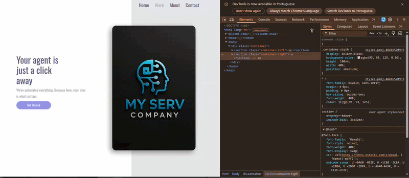
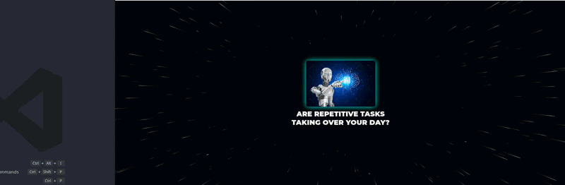
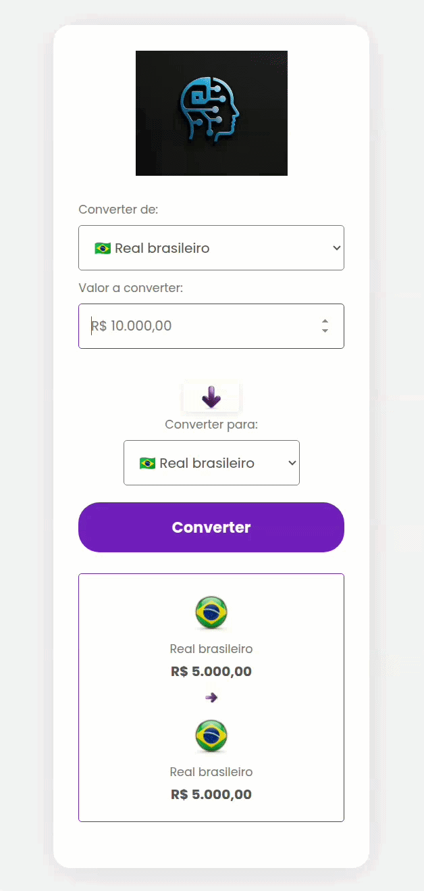
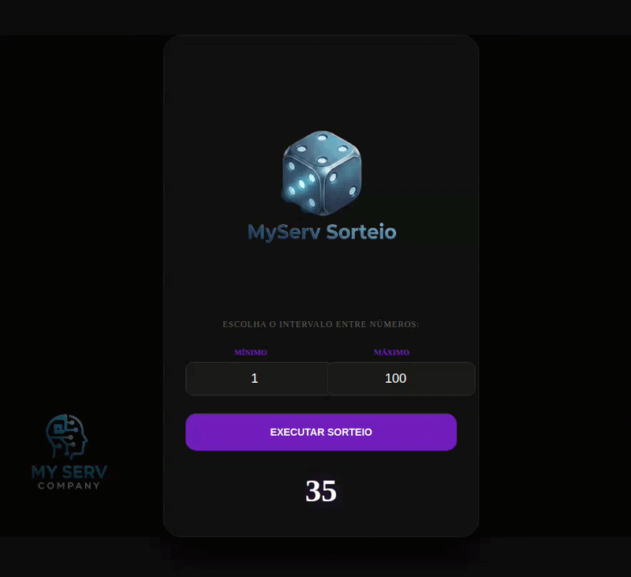
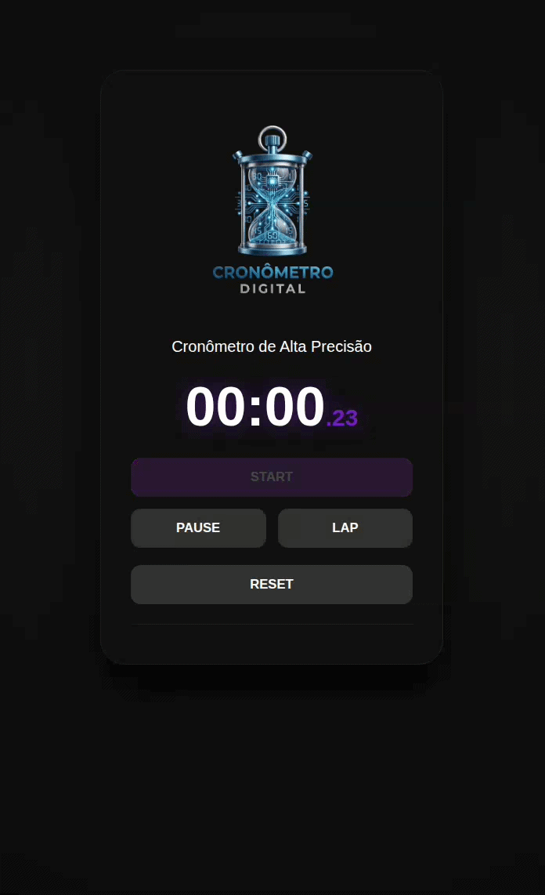

# 🧪 Laboratório Frontend - My Serv Company

Repositório dedicado ao desenvolvimento de interfaces modernas, estudos aprofundados de CSS/HTML/JS e construção de Landing Pages de alta conversão. Todo o código aqui serve como base para os portais e vitrines dos clientes da agência.

## 🚀 Tecnologias Aplicadas

* **HTML5 Semântico:** Estruturação otimizada para SEO e acessibilidade.
* **CSS3 Avançado:** Flexbox, CSS Grid, animações responsivas e efeitos visuais imersivos.
* **Design Responsivo:** Interfaces fluidas que se adaptam desde dispositivos móveis até painéis de monitoramento desktop.

---

## 📂 Vitrine de Projetos (Index)

### 📱 1. Layout Responsivo (`index-projeto-css.html`)
Foco total em adaptação fluida, garantindo que a interface entregue a melhor experiência de usuário independentemente do tamanho da tela (Mobile, Tablet ou Desktop).
 

  

### 🌀 2. Efeito Imersivo (`index-tunel.html`)
Desenvolvimento de animações avançadas em CSS puro. O "Túnel MyServ" demonstra o controle de profundidade e keyframes para reter a atenção do usuário.
 

  

### 🚧 3. Dinamismo Visual (`index-velocidade-da-luz.html`) - *[WIP]*
*[Em Desenvolvimento]* - Arquivo base preparado para implementação de efeitos de aceleração (Velocidade da Luz) e validação de esteira de integração contínua (CI/CD) via Git.
 

 

### 💰 4. Engenharia de Câmbio
Lógica de conversão "Universal" (Any-to-Any) com normalização de dados e interface reativa para múltiplos ativos financeiros.
 

 

### 🎲 5. Sorteio de Comando
Lógica de geração aleatória com parametrização de intervalo dinâmico (Mínimo/Máximo) e interface imersiva.
 

 

### ⏱️ 6. Motor de Cronometragem (Cronômetro)
Lógica de controle de estado assíncrono (Start/Pause/Reset) utilizando processamento de intervalos em tempo real e renderização dinâmica de interface.
 

 

### 🎰 7. Motor de Decisão Assíncrona (Jokenpô Casino)
Implementação de máquina de estados com buffer de memória visual, utilizando orquestração de temporizadores assíncronos (Event Loop) e encapsulamento modular de UI.
 

 
---
*Mantido e versionado diretamente do nó local (HP ProLiant ML30 Gen9) por Jean Teles.*
